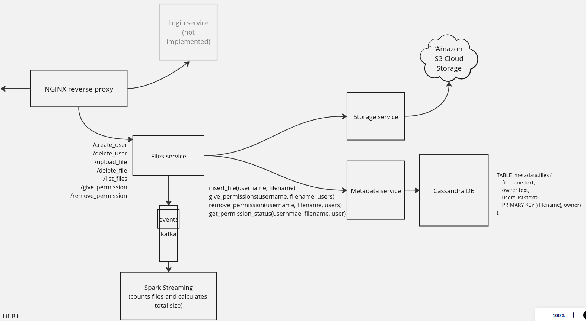

# LiftBit

## Prerequisites
- Docker
- Docker Compose

## Usage

Create `./storage_ms/.env`, put there your Amazon AWS credentials:
```
S3_KEY_ID=...
S3_KEY_SECRET=...
```


### Starting the containers
To (re)build images and start the containers, run the following in the project root directory:
```bash
$ PORT=3000 docker compose up --build -d
```
The endpoint will be available at port 3000 on any interface (e.g. http://localhost:3000).

### Stopping the containers
To stop the containers, run the following in the project root directory:
```bash
$ docker compose down
```

### Using API

The whole platform is organized into users. Each user has a set of his files. 

The owner can upload, download, delete and list his files.

The owner can also give and remove the permission for downloading to other users.

Please, use Swagger interface that is available at /docs. Also we've written the script for uploading the file.

**Note**: the first parameter for every enpoint is a username. It identifies the account that user is logged in (authentication is not yet implemented).

#### Register


#### Delete my account


#### Uploading file


#### Deleting file


#### List files (of myself)


#### Give permission (for reading)


#### Remove permission (for reading)


### System design



#### NGINX reverse proxy

Exposes the needed endpoints from virtual network

#### Files service

Currently the only service that handles the requests from outside.

Pushes events (downloading and uploading) along with filename and size of the file to Kafka topic.

#### Spark Streaming

We used Spark Structured Streaming to calculate the number and total size of downloaded files. In particular, the spark streaming part performs as follows:
1. Read events from kafka topic
2. Filter to get only downloading events
3. Calculate the number and total size of the downloaded files for each non-overlapping 5 minutes window (tumbling window)
4. Print the results to the console (will be available in the logs of analytics-ms service).

#### Storage service

Handles uploading and downloading file content from Amazon S3.

#### Metadata service

In principle, it should give additional metadata that is not stored in Amazon S3. For now, it only handles permissions of the files (what users are allowed to download what files).

